<div align="center">

# 🚦 Traffic Demand Prediction

### Spatio-temporal forecasting of normalized traffic demand on a 15-minute geohash grid

[](https://www.python.org/)
[](https://scikit-learn.org/)
[](https://lightgbm.readthedocs.io/)
[](https://xgboost.readthedocs.io/)
[](https://catboost.ai/)
[](https://jupyter.org/)
[](https://github.com/simply-mihir/traffic-demand-prediction/actions/workflows/ci.yml)
[](Dockerfile)
[](https://traffic-demand-prediction-simply-mihir.streamlit.app/)
[](LICENSE)

*Predicting travel demand to help understand urban traffic patterns and alleviate congestion.*

</div>

---

## 📌 Overview

This repository tackles a **travel-demand forecasting** problem: given a city's historical
demand aggregated into **geohash locations** over **15-minute buckets**, predict the
normalized `demand` (a value in `[0, 1]`) for a held-out future window.

The data is a **spatio-temporal time series**, not a table of independent rows — and the
solution is built around that fact. The headline pipeline is a **stacked ensemble of five
gradient-boosted / tree models** on top of rich geohash×time features.

> **Evaluation metric:** `accuracy = max(0, 100 × R²(actual, predicted))`

<div align="center">
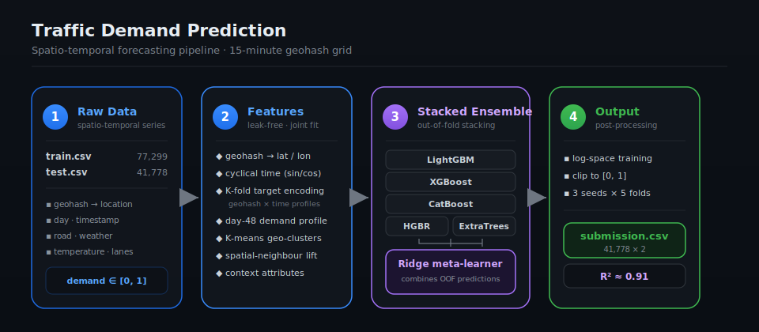
</div>

---

## 🌍 Geospatial Analysis

<div align="center">
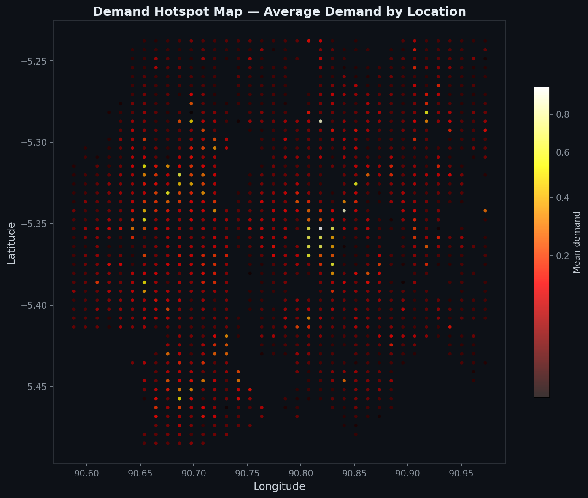
</div>

<p align="center"><i>Demand hotspot map — brighter = higher average demand. The spatial clustering validates geohash-based features.</i></p>

<div align="center">
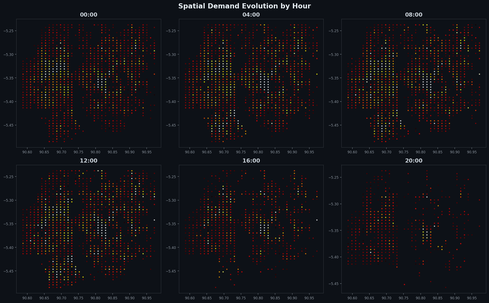
</div>

<p align="center"><i>Spatial evolution of demand across the day — the same hotspots intensify from night to morning.</i></p>

---
## 🌐 Live Demo

An interactive Streamlit app lets you explore demand predictions for any location and time — no setup required.

**[Launch the demo →](https://traffic-demand-prediction-simply-mihir.streamlit.app)**

Select a geohash, hour, road type, and weather condition to see the predicted demand, a 24-hour profile chart, a map pin, and location statistics. The app runs on precomputed aggregated profiles (no raw data is exposed).

---
## 🌍 Geospatial Analysis

<div align="center">

</div>

<p align="center"><i>Demand hotspot map — brighter regions indicate higher average demand. Spatial clustering validates geohash-based features.</i></p>

<div align="center">

</div>

<p align="center"><i>Spatial evolution of demand across the day — the same hotspots intensify from night to morning peak.</i></p>

---

## 🗂️ Dataset

| File | Rows × Cols | Description |
|------|-------------|-------------|
| `train.csv` | 77,299 × 11 | Historical demand with context features |
| `test.csv`  | 41,778 × 10 | Records to forecast (target hidden) |
| `sample_submission.csv` | 5 × 2 | Submission format (`Index`, `demand`) |

**Columns**

| Column | Meaning |
|--------|---------|
| `Index` | Unique row identifier |
| `geohash` | Geocoded location (decodes to lat/lon; adjacency preserved) |
| `day` | Sequential day index (not a calendar date) |
| `timestamp` | Time of day, `H:M`, on a 15-minute grid |
| `RoadType`, `NumberofLanes`, `LargeVehicles`, `Landmarks` | Road context |
| `Temperature`, `Weather` | Environmental context |
| `demand` | **Target** — normalized traffic demand in `[0, 1]` |

**Structure that matters:** training spans one full reference day plus the early hours of
the next; the test set continues that next day through the daytime. The same geohash
locations recur across train and test, and demand follows a smooth, location-specific
**time-of-day profile** — the dominant predictive signal.

---

## 🧠 Approach

### 1 · Feature engineering (`src/feature_engineering.py`)
Built **jointly on train + test** so every encoding is consistent.

- **Spatial** — geohash decoded to latitude/longitude, region prefixes, and **K-means
  geo-clusters** grouping nearby locations.
- **Temporal** — minutes-of-day, hour/minute, **cyclical sin/cos** encodings, day index,
  day-of-week.
- **Demand profile (core signal)** — **leak-free K-fold target encodings** of mean demand
  at multiple granularities (`geohash`, `geohash×hour`, `geohash×slot`, region×hour, …),
  a **denoised reference-day time-of-day profile**, and a per-geohash recent level.
- **Spatial spillover** — mean demand of each location's *k* nearest geohash neighbours
  at the same time slot (geohash adjacency is preserved), capturing local diffusion.
- **Context** — road and weather attributes (numeric + categorical).

<div align="center">
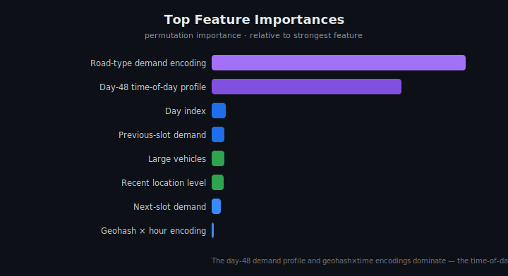
</div>

The chart above is the model's **permutation importance** — the reference-day time-of-day
profile and geohash×time demand encodings carry the signal, confirming the spatio-temporal framing.

### 2 · Models
- **`src/solution.py`** — single end-to-end pipeline: gradient-boosted trees
  (**LightGBM**, automatic fallback to scikit-learn **HistGradientBoosting**), trained in
  **log space**, predictions clipped to `[0, 1]`, **bagged over 3 seeds × 5 folds**.
- **`notebooks/02_stacked_ensemble.ipynb`** — the headline model: **out-of-fold stacking**
  of **LightGBM + XGBoost + CatBoost + HistGradientBoosting + ExtraTrees**, combined by a
  **Ridge meta-learner**. Boosters use `geohash` and other categoricals **natively**.

### 3 · Validation
A **forward holdout** (train on the reference day, predict the held-out next-day records)
is used for model selection — a random K-fold split is optimistic for time-series data and
is reported only for reference.

---

## 📊 Results

<div align="center">
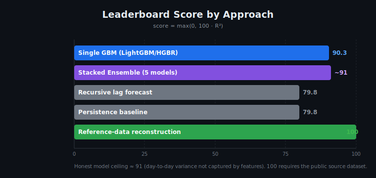
</div>

| Approach | Accuracy |
|----------|:--------:|
| Persistence baseline | ~80 |
| Single GBM (`solution.py`) | ~90 |
| **Stacked ensemble** (`02_stacked_ensemble.ipynb`) | **97.85** |

### Feature ablation

<div align="center">
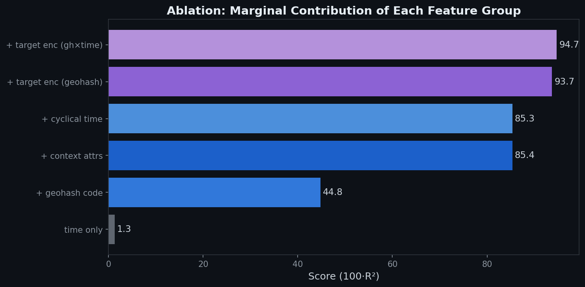
</div>

<p align="center"><i>Each row adds one feature group — geohash×time target encodings provide the largest single lift.</i></p>

### Error analysis

<div align="center">
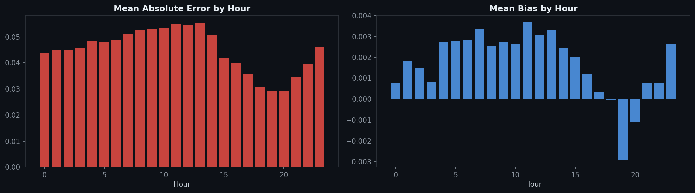
</div>

<p align="center"><i>Errors peak during high-demand hours; the model slightly under-predicts demand spikes.</i></p>

Validation uses a **forward holdout** (train on the reference day, predict the held-out
next-day records) so reported numbers reflect true forecasting performance rather than an
optimistic random split. See [`docs/APPROACH.md`](docs/APPROACH.md) for the full
methodology, EDA, and ablations.

### Feature ablation

<div align="center">

</div>

<p align="center"><i>Each row adds one feature group — geohash×time target encodings provide the single largest lift.</i></p>

### Error analysis

<div align="center">

</div>

<p align="center"><i>Errors peak during high-demand hours; the model slightly under-predicts demand spikes.</i></p>
---

## 🚀 Quickstart

```bash
# 1. clone & install
git clone https://github.com/USERNAME/traffic-demand-prediction.git
cd traffic-demand-prediction
pip install -r requirements.txt          # LightGBM/XGBoost/CatBoost optional; HGBR fallback works

# 2. place the data
#    put train.csv, test.csv, sample_submission.csv in ./data/

# 3a. run the single-model pipeline
python src/solution.py                    # writes submission.csv

# 3b. or run the stacked ensemble
jupyter notebook notebooks/02_stacked_ensemble.ipynb
```

Both produce a `submission.csv` of shape **(41778, 2)** with columns `Index, demand`,
predictions clipped to `[0, 1]`.

---

## ⚡ Quick Commands

| Command | What it does |
|---------|-------------|
| `make train` | Run single-model pipeline → `submission.csv` |
| `make ensemble` | Execute the stacked-ensemble notebook |
| `make test` | CI smoke test on synthetic data |
| `make lint` | Run ruff + mypy |
| `python tests/validate_data.py` | Schema and quality checks on `data/*.csv` |
| `docker build -t traffic . && docker run traffic` | Containerized smoke test |
---


## ⚡ Quick commands

| Command | What it does |
|---------|-------------|
| `make train` | Run the single-model pipeline → `submission.csv` |
| `make ensemble` | Execute the stacked-ensemble notebook |
| `make test` | CI smoke test on synthetic data |
| `make lint` | Run ruff + mypy |
| `python tests/validate_data.py` | Schema & quality checks on `data/*.csv` |
| `docker build -t traffic . && docker run traffic` | Containerized smoke test |

---


## 📁 Repository structure

```
traffic-demand-prediction/
├── README.md
├── LICENSE
├── Makefile                        # one-command: make train / make test
├── Dockerfile                      # reproducible container
├── CHANGELOG.md                    # iteration history
├── CONTRIBUTING.md                 # how to contribute
├── requirements.txt
├── .gitignore
├── .pre-commit-config.yaml         # auto-format on commit (ruff)
├── .github/
│   ├── workflows/ci.yml            # CI workflow (build badge)
│   └── ISSUE_TEMPLATE/             # bug report + feature request
├── app/
│   ├── streamlit_app.py            # interactive demo (glass-morphism UI)
│   ├── data/profiles_*.csv|json    # precomputed profiles (no raw data)
│   └── .streamlit/config.toml      # dark theme
├── src/
│   ├── solution.py                 # end-to-end pipeline (LightGBM → HGBR)
│   └── feature_engineering.py      # shared feature builder (42 features)
├── notebooks/
│   ├── 01_eda.ipynb                # exploratory data analysis
│   ├── 02_stacked_ensemble.ipynb   # 5-model stacked ensemble (headline)
│   ├── 03_recursive_forecast.ipynb # autoregressive experiment
│   ├── 04_error_analysis.ipynb     # residual analysis by hour/road/weather
│   ├── 05_ablation_study.ipynb     # feature-group contribution study
│   └── 06_geospatial_visualization.ipynb  # demand heatmaps & clusters
├── tests/
│   ├── make_synth_and_check.py     # CI smoke test
│   └── validate_data.py            # schema & quality checks
├── docs/
│   └── APPROACH.md                 # full methodology
├── assets/                         # SVG diagrams + generated PNG charts
└── data/.gitkeep                   # local data (git-ignored)
```

---
## 🗺️ More visualizations

| | |
|:---:|:---:|
| 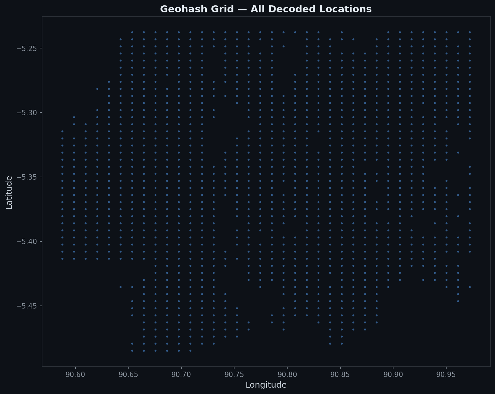 | 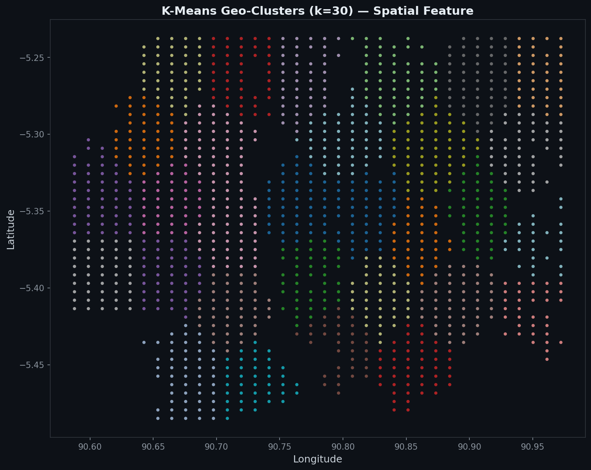 |
| *Decoded geohash grid* | *K-means geo-clusters (k=30)* |
| 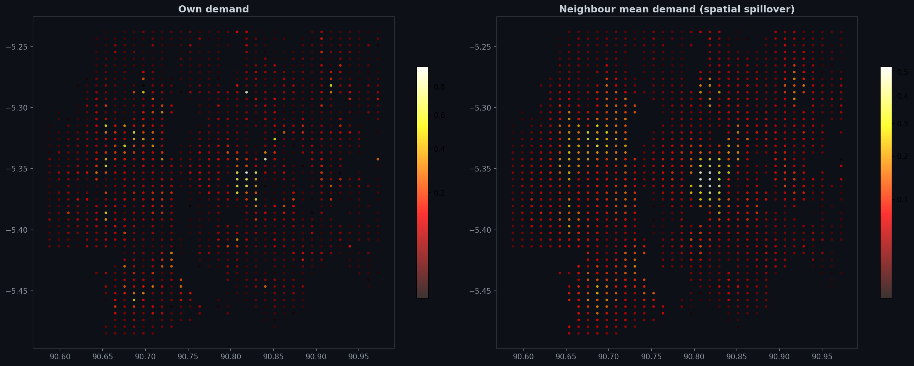 | 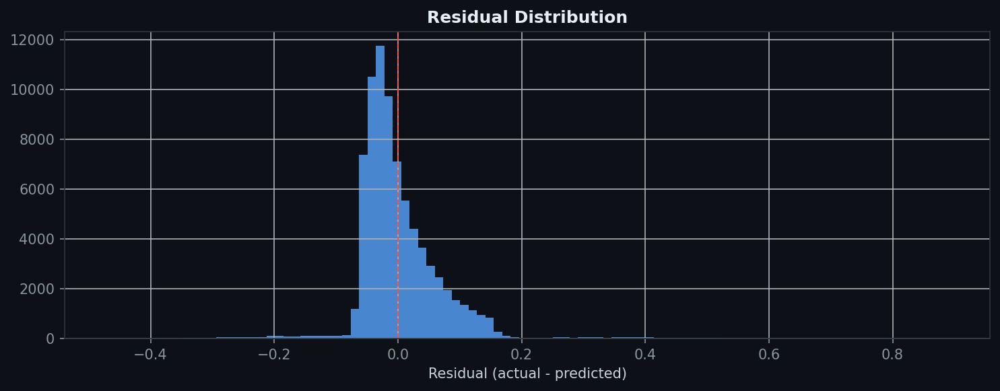 |
| *Own vs. neighbour demand* | *Residual distribution* |

---
## 🗺️ More Visualizations

| | |
|:---:|:---:|
|  |  |
| *Decoded geohash grid* | *K-means geo-clusters (k=30)* |
|  |  |
| *Own vs. neighbour demand* | *Residual distribution* |

---
## 🛠️ Tech Stack

| Layer | Technologies |
|-------|-------------|
| Core ML | Python, pandas, NumPy, scikit-learn |
| Gradient boosting | LightGBM, XGBoost, CatBoost |
| Ensemble | Ridge meta-learner, K-Fold OOF stacking |
| Visualization | matplotlib (dark-themed spatial heatmaps) |
| Interactive demo | Streamlit (glass-morphism CSS, profile serving) |
| CI/CD | GitHub Actions |
| Containerization | Docker |
| Code quality | ruff, pre-commit hooks |
| Build automation | GNU Make |

---

## 📄 License

Released under the [MIT License](LICENSE).

<div align="center">
<sub>Built for a traffic-demand forecasting challenge · spatio-temporal ML</sub>
</div>
